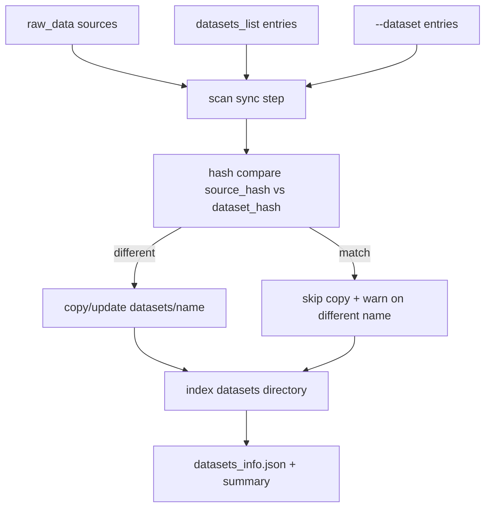

# Smart Train (smartrain)

Инструменты для подготовки датасетов YOLO (Ultralytics), обучения, очереди задач и анализа прогонов. Всё завязано на **корень workspace** — каталог с `raw_data/`, `datasets/`, `runs/` и т.д.

## Требования

- Python **3.10+**

## Установка

```bash
cd /path/to/smart-train
pip install -e .
```

Команда в PATH: **`smartrain`** (см. `[project.scripts]` в `pyproject.toml`). Без установки из исходников: `python -m smartrain` из корня репозитория (нужен доступ к пакету `smartrain` в `PYTHONPATH`).

Опционально — зависимости для разработки и тестов:

```bash
pip install -e ".[dev]"
```

## Workspace

- **`SMART_TRAIN_WORKSPACE`** — переменная окружения с абсолютным путём к корню workspace.
- **`smartrain --workspace /path/to/ws ...`** — то же; значение **перекрывает** переменную окружения для текущего процесса.
- При первом запуске любой подкоманды, если workspace ни откуда не задан, в окружение подставляется **текущий каталог** (`getcwd()`). Модули, которым нужен явный корень (через `resolve_workspace_root`), по-прежнему требуют `--workspace` или `SMART_TRAIN_WORKSPACE`.

Инициализация структуры каталогов и пустых `datasets_info.json`:

```bash
cd /path/to/my_workspace
smartrain deploy
```

Создаются: `raw_data/`, `datasets/`, `runs/`, `analytics/`, `models/`, `tmp/` и при необходимости пустые JSON в `raw_data/` и `datasets/`.

## Справка по CLI

- Общая справка: `smartrain --help`
- Подкоманды с argparse: **`smartrain <команда> --help`** (например `smartrain train --help`, `smartrain queue list --help`). Справка строится через `argparse` и показывает значения по умолчанию для опций.
- При необходимости разделить аргументы Typer и argparse в старых сценариях можно использовать **`--`**: `smartrain train -- --help` (эквивалентно `smartrain train --help`).

## Быстрый старт

```bash
cd /path/to/my_workspace
smartrain deploy
smartrain scan --help
smartrain train --help
smartrain stats classes --help
```

Типовой сценарий из корня workspace (после `deploy` и заполнения `raw_data/`):

```bash
smartrain scan
smartrain fusion --dataset ds1 --dataset ds2 --classes "class_a,class_b"
# создаётся datasets/YYYY-MM-DD_HH-MM-SS-merged (см. вывод [INFO])
smartrain train --data <имя_этого_каталога>
# или полностью интерактивно (без аргументов):
smartrain train
# фиксированное имя: smartrain fusion --output-name my_merge --dataset ds1 --dataset ds2 --classes ...
```

Что делает `scan` в актуальной версии:

- синхронизирует новые/обновлённые источники из `raw_data/` в `datasets/`;
- сравнивает источники и готовые датасеты по контентным хешам (`source_hash`/`dataset_hash`);
- пропускает перенос, если данные уже есть в `datasets` (даже под другим именем), и печатает предупреждение;
- обнаруживает ручные изменения в `datasets` и автоматически ставит `modified=true` (такой датасет больше не обновляется из `raw_data`).

Про `smartrain train` и YAML-конфиги:

- `--config` — базовый профиль smart-train.
- `--ultralytics_yaml` — внешний Ultralytics `args.yaml`.
- Приоритеты: `CLI > --ultralytics_yaml > --config > defaults`.
- Поле `data` из `--ultralytics_yaml` не используется: путь к датасету берётся из выбранного `--data`.
- Если после обучения падает тест (`CUDA out of memory`), снижайте нагрузку на `val()` через `--val-imgsz` и/или `--val-batch`.
- Отдельный тест уже обученной модели: `--test-only` + `--model-dir` (папка прогона).

Примеры:

```bash
# Только тест уже обученной модели (часто помогает, т.к. это отдельный процесс)
smartrain train --workspace /data/MarsSmarTrain \
  --data 2026-04-07_18-57-33-merged \
  --test-only \
  --model-dir /data/MarsSmarTrain/runs/<dataset>/<run_folder> \
  --val-imgsz 1280 --val-batch 1
```

Сканирование датасетов из файла со списком путей:

```bash
smartrain scan --datasets-list /path/to/workspace/raw_data/datasets_list.txt
```

Формат `datasets_list.txt`: один путь на строку (поддерживаются директории и `.zip`), строки с `#` и пустые игнорируются. Относительные пути интерпретируются относительно директории самого list-файла.

В workspace-режиме файл `raw_data/datasets_list.txt` подхватывается автоматически (если существует), даже без явного `--datasets-list`.

Явно обработать датасет по имени или пути и добавить его в `raw_data/datasets_list.txt`:

```bash
smartrain scan --dataset my_dataset
smartrain scan --dataset /abs/path/to/external_dataset
```

## Логика scan (схема)



## Команды CLI

| Команда | Назначение |
|---------|------------|
| `deploy` | Создать структуру workspace (Typer; свой `--help`) |
| `scan` | Сканирование `raw_data`, подготовка копий в `datasets` и обновление `datasets_info.json` / `class_names.json` / `datasets_scan_summary.json` |
| `fusion` | Сборка объединённого датасета в `datasets/` из явно выбранных входных датасетов (`--dataset`/`--datasets`, либо интерактивно) |
| `train` | Обучение YOLO (`model_training_module`) |
| `augment` | Офлайн-аугментация (`basic`/`conveyor`/`bbox_copy`) в новый `datasets/<name>` (`<dataset>_aug[_N]`) |
| `balance` | Балансировка в новый `datasets/<name>` (`<dataset>_balanced[_N]`) |
| `stats` | Статистика по датасетам в `datasets/`: `classes`, `datasets` |
| `hash` | Хеш датасета по файлам и размерам |
| `roi` | Кроп датасета по ROI (Ultralytics) |
| `queue` | Подкоманды: `list`, `add`, `remove`, `clear`, `run` |
| `queue-run` | Последовательный исполнитель очереди (без подменю) |
| `registry` | Реестр прогонов и моделей: `runs-list`, `runs-info`, … |
| `analyze` | `scan`, `export-table`, `compare`, `interactive` |
| `plot` | Устаревшая обёртка; передаёт аргументы в `analyze` |

В файле очереди указывайте полные вызовы, например: `smartrain train --data myset -y`.

Все команды, создающие новый датасет, сохраняют паспорт изменений:
`datasets/<new_dataset>/dataset_passport.json` — источник, параметры, трансформации, хеши и метрики до/после.

Типы паспортов:

- `scan` — **начальный паспорт** (`parameters.kind=initial`) для датасета в `datasets/`, если файла ещё не было.
- `fusion` — паспорт объединения нескольких датасетов.
- `roi` — паспорт ROI-кропа (политика ROI, порог, class_ids, on_empty).
- `augment` — паспорт офлайн-аугментации (`<dataset>_aug[_N]`).
- `balance` — паспорт балансировки (`<dataset>_balanced[_N]`).
- `cvat import` — паспорт конвертации CVAT 1.1 zip -> YOLO.

## Очередь

- Файл очереди по умолчанию: **`queue.txt`** в корне workspace (не `training_queue.txt`).
- Статусы исполнителя: **`tmp/status.txt`** рядом с workspace.
- Запуск с GUI: `smartrain queue run` (по умолчанию может открываться `gnome-terminal`). Без GUI: флаг **`--no-gui`** у `queue run` или у **`smartrain queue-run`**.

## Зависимости

Список в [`pyproject.toml`](pyproject.toml): ultralytics, pyyaml, tqdm, pandas, matplotlib, pillow, numpy, typer, rich.

## Разработка и тесты

```bash
pip install -e ".[dev]"
pytest
```

Конфигурация pytest: `testpaths = ["tests"]`, `pythonpath = ["."]` в `pyproject.toml`.

## Документация

Каталог [`docs/`](docs/): форматы данных, workspace, примеры, метаданные прогонов. Навигация: [`docs/index.md`](docs/index.md).

## Устранение неполадок

- **«Не задан корень workspace»** — задайте `SMART_TRAIN_WORKSPACE` или `smartrain --workspace ...` для команд, которые резолвят workspace через `resolve_workspace_root`.
- **Неверное имя датасета в `train --data`** — имя должно быть ключом в `datasets/datasets_info.json`; в сообщении об ошибке перечислены известные имена.
- Больше примеров и типичных ошибок: [`docs/examples.md`](docs/examples.md).
