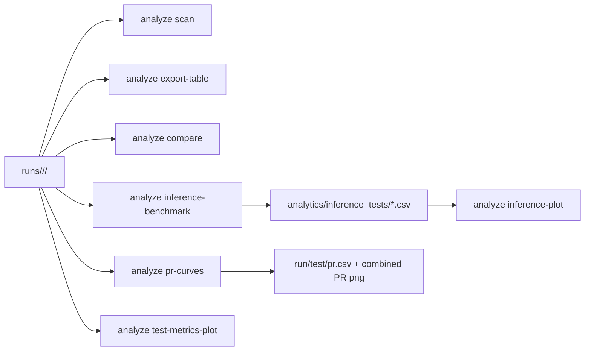

> Russian version: [../ru/cli/analyze.md](../ru/cli/analyze.md)

# CLI: run analysis

`smartrain analyze` operates on run artifact catalogs.
Without subcommand in TTY it starts interactive full-analysis orchestrator (equivalent to `smartrain analyze all`).

Default search root: directory `runs` inside the workspace (or path from `--models-root`).

## Subcommands

- `scan`
- `all`
- `export-table`
- `compare`
- `leaderboard`
- `pr-curves`
- `inference-benchmark`
- `inference-plot`
- `test-metrics-plot`

## Examples

```bash
smartrain analyze scan
smartrain analyze              # interactive orchestrator (TTY)
smartrain analyze all --analytics-session my_session
smartrain analyze all --report-languages ru,en --scatter-x avg_inference_ms_per_frame --scatter-y mAP50-95
smartrain analyze all --val-batch 1 --val-imgsz 640 --val-half --gpu-only-val
smartrain analyze export-table -o runs_summary.csv
smartrain analyze compare --baseline /path/to/run_a --others /path/to/run_b /path/to/run_c --out-csv cmp.csv
smartrain analyze compare            # interactive fallback in TTY
smartrain analyze compare --baseline /path/to/run_a --others /path/to/run_b --out-insights cmp_insights.txt
smartrain analyze leaderboard --quality-metric mAP50-95 --speed-metric avg_inference_fps -o leaderboard.csv
smartrain analyze pr-curves --runs-group-dir runs/ds_a --data-yaml datasets/ds_a/data.yaml
smartrain analyze pr-curves --runs-group-dir runs/ds_a --data-yaml datasets/ds_a/data.yaml --pr-per-class
smartrain analyze inference-benchmark --runs-group-dir runs/ds_a --data-yaml datasets/ds_a/data.yaml --split test --frames 200
smartrain analyze inference-plot --csv benchmark.csv --out-png benchmark.png
smartrain analyze test-metrics-plot --runs-group-dir runs/ds_a --metrics mAP50 mAP50-95 Box-F1
```

## Artifacts

- Default root for new analyze sessions: `workspace/analytics/analyze-reports/<session>/`.
- `all` builds a full session with:
  - `session.json`
  - `ru/index.md` and `en/index.md`
  - optional `report-ru.pdf|odt` and `report-en.pdf|odt`
  - `artifacts/compare|metrics|inference|pr|leaderboard|table|speed_quality`
  - `artifacts/table/system_profile_compare.csv` (hardware profile comparison by run)
- Report structure updates:
  - format alias legend and metric calculation settings are placed in section 1 (context/artifacts)
  - speed analysis is embedded into `4.2` as a nested subsection
  - leaderboard is rendered in the conclusion section
- Table rendering updates:
  - integer-valued fields are rendered as integers (without trailing `.0000`)
  - table headers are normalized to consistent human-readable names (RU/EN)
  - ODT post-processing enforces visible table borders, bold centered header row, and tuned column widths
- Analyze reports are narrative-first (by comparison meaning), including:
  - executive summary, context, quality, speed, per-class analysis, conclusion
  - captions for tables/figures and optional abbreviations glossary for wide tables
- `session.json` now contains sections: `metric_sources`, `pr_per_class`, `speed_quality`, `tables`, `images`, `cache`, `artifact_scope`.
- Format comparison reads per-format artifacts from test manifests and supports entries with multiple artifacts per format (`formats.<fmt>.artifacts`), selecting available metrics sources with legacy fallback.
- For runs produced by external inference in cls/seg modes, degraded-contract payloads are expected when provider runtime lacks `probs/masks`:
  - classification rows may contain `task_outputs.classification = {}`
  - segmentation rows may contain `task_outputs.segments = []`
  - aggregate visibility comes from `summary.task_outputs_total` and `summary.capability_gap_images`
- **Segmentation metrics in analyze:** runs with `training_metadata.json` → `task_type=segmentation` expose mask columns (`mask_mAP50-95`, `Mask-F1`, …) in `format_metrics_compare_*.csv`, `compare_delta.csv`, and `runs_summary.csv` (`test_mask_*` prefixes). When mask columns are absent in a CSV, analyze falls back to box metrics (`mAP50-95`, `Box-F1`, …). `test-metrics-plot` picks defaults from the first run's task and CSV headers.
- `analyze all` supports:
  - `--report-languages` (default `ru,en`)
  - `--scatter-x` / `--scatter-y` for speed-quality scatter axes
  - memory-safe validation options: `--val-batch`, `--val-imgsz`, `--val-half|--no-val-half`, `--gpu-only-val|--allow-cpu-fallback`
  - in interactive flow, validation profile (`batch/imgsz/half`) is auto-resolved from each run's `train/args.yaml` to keep metrics consistent with that run
- PR artifacts include:
  - `artifacts/pr/pr_all_classes.png`
  - `artifacts/pr/per_class/pr_class_*.png`
  - `artifacts/pr/per_class/pr_per_class.csv`
- Speed/quality artifacts include:
  - `artifacts/speed_quality/speed_vs_map.png`
  - `artifacts/speed_quality/speed_quality.csv`
- Single-run cache layout:
  - `runs/<...>/<run>/.smartrain_cache/analyze/cache_manifest.json`
  - `.../metrics/`, `.../pr/aggregate`, `.../pr/per_class`, `.../inference/bench_<fingerprint>.csv`
- `export-table` generates a summary CSV for the found runs.
- `export-table` summary includes flattened `sys_*` columns from `training_metadata.system_profile` (CPU/GPU/RAM/disk/platform).
- `compare` can create a comparison table and PNG graphics.
- `compare` also creates plain text auto-insights (`--out-insights`).
- `compare` without `--baseline/--others` starts interactive selection in terminal (TTY).
- `pr-curves` builds per-run `test/pr.csv`, optional per-class CSV, and a combined PR plot.
- `inference-benchmark` generates a CSV with inference measurements.
- `inference-plot` builds a visualization based on the CSV from `inference-benchmark`.
- `test-metrics-plot` builds bar charts from `test_metrics*.csv` across a runs group.
- `leaderboard` generates ranked CSV using weighted quality/speed/stability score.

`smartrain plot` remains a legacy wrapper and delegates to `analyze`.

## Contracts

- Run is considered discoverable when directory contains at least one run artifact:
  - `training_metadata.json`, or
  - `train/args.yaml`, or
  - `train/results.csv`, or
  - `train/weights/last.pt` / `<run_dir_name>.pt` in run root.
- For summary/metrics extraction, `analyze` still requires readable metadata/metrics files depending on subcommand.
- Run model artifacts are expected under `runs/<dataset>/<run>/models/` (legacy root paths are still read as fallback).
- `export-table` reads:
  - `training_metadata.json`
  - latest `test_metrics*.csv` (first row)
  - `train/results.csv` (last epoch)
- `compare` reads:
  - baseline/others latest `test_metrics*.csv` (first row) to compute `delta_*`
  - baseline/others `train/results.csv` for epoch curves and last-epoch bars
- `leaderboard` reads latest run metrics and writes `composite_score` based on configurable weights.
- `pr-curves`, `inference-benchmark`, `inference-plot`, `test-metrics-plot` support TTY prompts when required args are omitted.

## Data flow


