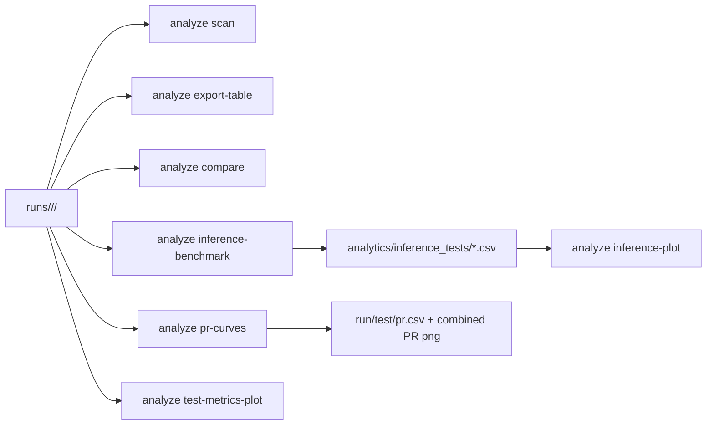

> Russian version: [../ru/cli/analyze.md](../ru/cli/analyze.md)

# CLI: run analysis

`smartrain analyze` operates on run artifact catalogs.

Default search root: directory `runs` inside the workspace (or path from `--models-root`).

## Subcommands

- `scan`
- `export-table`
- `compare`
- `interactive`
- `pr-curves`
- `inference-benchmark`
- `inference-plot`
- `test-metrics-plot`

## Examples

```bash
smartrain analyze scan
smartrain analyze export-table -o runs_summary.csv
smartrain analyze compare --baseline /path/to/run_a --others /path/to/run_b /path/to/run_c --out-csv cmp.csv
smartrain analyze pr-curves --runs-group-dir runs/ds_a --data-yaml datasets/ds_a/data.yaml
smartrain analyze inference-benchmark --runs-group-dir runs/ds_a --data-yaml datasets/ds_a/data.yaml --split test --frames 200
smartrain analyze inference-plot --csv benchmark.csv --out-png benchmark.png
smartrain analyze test-metrics-plot --runs-group-dir runs/ds_a --metrics mAP50 mAP50-95 Box-F1
```

## Artifacts

- `export-table` generates a summary CSV for the found runs.
- `compare` can create a comparison table and PNG graphics.
- `pr-curves` builds per-run `test/pr.csv` and a combined PR plot.
- `inference-benchmark` generates a CSV with inference measurements.
- `inference-plot` builds a visualization based on the CSV from `inference-benchmark`.
- `test-metrics-plot` builds bar charts from `test_metrics*.csv` across a runs group.

`smartrain plot` remains a legacy wrapper and delegates to `analyze`.

## Data flow


