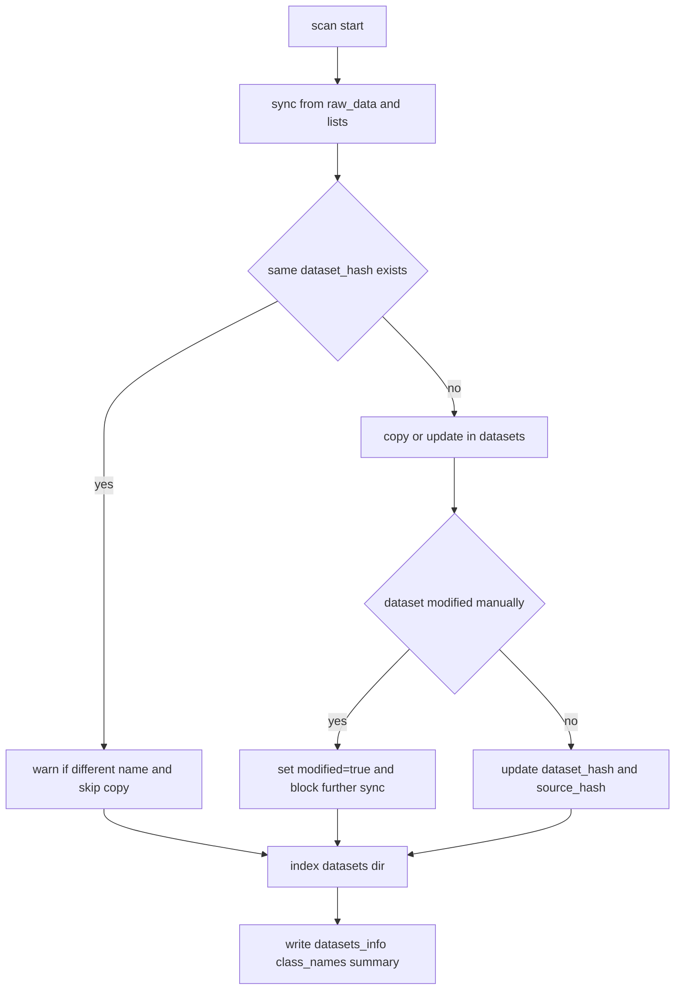

# О датасетах: где лежит описание

В **smart-train** описание конкретных датасетов (имена, классы, структура каталогов, число элементов, пути) хранится не в отдельной вики, а в **сводном JSON** после сканирования диска. Ниже — куда смотреть и какие документы читать.

## Каталог датасетов на диске: `datasets_info.json`

После команды **`smartrain scan`** в `datasets/` создаётся или обновляется файл **`datasets_info.json`**: по каждому найденному набору там есть ключ (имя датасета) и поля `classes`, `structure`, `elements_count`, а также служебные поля синхронизации (`dataset_hash`, `source_hash`, `source_ref`, `modified`, `source_signature`), плюс опциональные `data_path`, `tags`, `roi_auto`.

Там же перезаписываются **`class_names.json`** (объединение имён классов по всем попавшим в скан датасетам) и **`datasets_scan_summary.json`**: итоговые списки датасетов и классов, а также относительно *предыдущего* запуска — какие ключи **добавлены** и какие **исключены** из индекса (по текущему содержимому `datasets/`). В консоль выводится краткий отчёт с теми же сведениями.

Полная спецификация полей, правил списка `datasets_list.txt` и источников сканирования:

- **[Формат datasets_info.json](data_formats.md#формат-datasets_infojson)** в [data_formats.md](data_formats.md)

Итого: **«описание самих датасетов» в машиночитаемом виде** — это записи внутри `datasets_info.json`; человекочитаемое сопровождение — раздел **data_formats.md** выше.

## Структура папок, аннотации, `data.yaml`

Как устроены каталоги YOLO (split / flat / subset_flat и т.д.), формат строк в `.txt`, полигоны, сегментация, файл **`data.yaml`**:

- **[Структура датасетов YOLO](data_formats.md#структура-датасетов-yolo)**
- **[Формат аннотаций YOLO](data_formats.md#формат-аннотаций-yolo)**
- **[Формат data.yaml](data_formats.md#формат-datayaml)**

## Где физически лежат данные в workspace

Корень **`SMART_TRAIN_WORKSPACE`**, каталоги **`raw_data`**, **`datasets`**, как задаётся **`data_path`**:

- **[workspace.md](workspace.md)**

## Как получить и обновить описание

1. Положить датасеты (или список путей в `datasets_list.txt`) согласно [workspace.md](workspace.md).
2. Выполнить **`smartrain scan`** (см. [examples.md](examples.md) и корневой README).
3. Открыть сгенерированный **`datasets_info.json`** и при необходимости править опциональные поля (`data_path`, `tags`, `roi_auto`) — правила в [data_formats.md](data_formats.md).

## Блок-схема синхронизации

## Сводка по документам

| Вопрос | Документ |
|--------|----------|
| Что за датасеты есть и какие у них классы | Записи в `datasets_info.json` + [спецификация](data_formats.md#формат-datasets_infojson) |
| Что изменилось после последнего `scan` | `datasets_scan_summary.json` + строки `[INFO]` в выводе команды |
| Как устроены каталоги и разметка | [data_formats.md](data_formats.md) |
| Куда положить сырые данные | [workspace.md](workspace.md) |
| Пример полного цикла | [examples.md](examples.md) |
