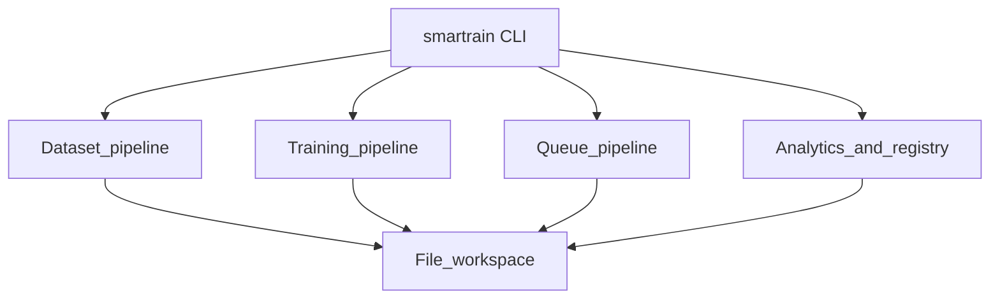
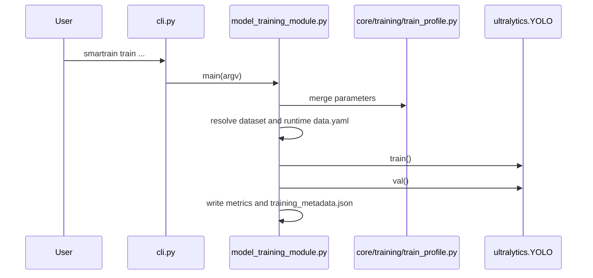
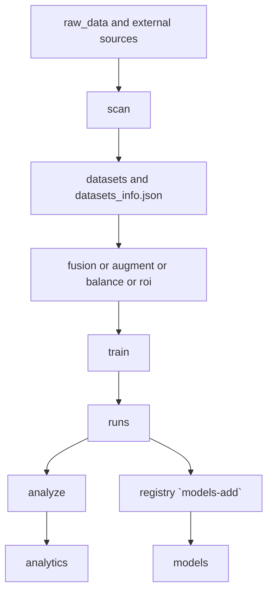
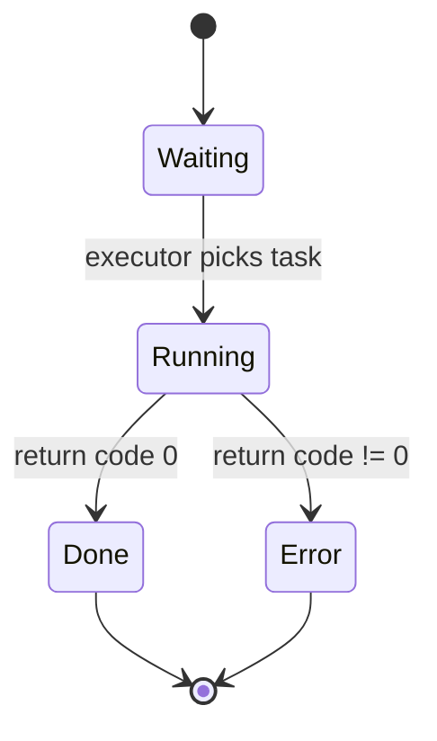
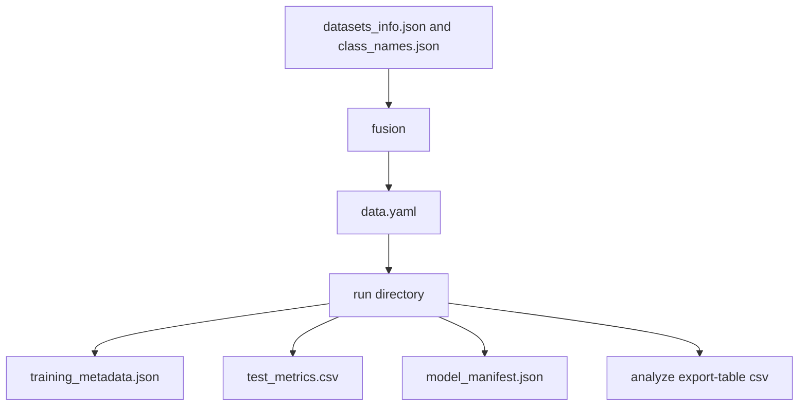
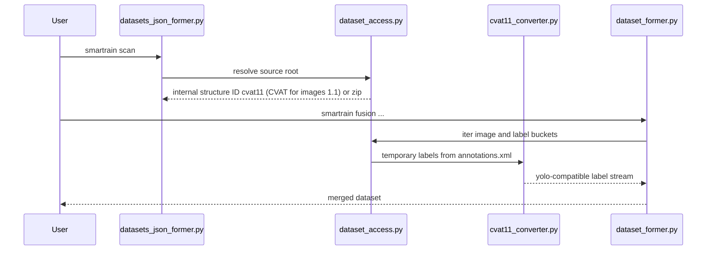

> Russian version: [../ru/development/architecture.md](../ru/development/architecture.md)

# Architecture and diagrams

This document captures real code flows and helps you quickly locate where to make changes.

Sources of truth for this section: `smartrain/cli.py`, `smartrain/workflows/training/model_training_module.py`, `smartrain/workflows/analyze/results_analyzer.py`, `smartrain/training_queue.py`, `smartrain/core/runtime/workspace_paths.py`, `smartrain/providers/cli.py`, `smartrain/providers/core/global_index.py`.

## 1) Top-level architecture

What it shows: four core system flows connected through the file-based workspace.
How to read: start at `smartrain CLI`, then follow subsystem links to filesystem state.
Practical takeaway: changes to file contracts affect multiple commands at once.

## 2) Sequence `smartrain train`

What it shows: the complete path from the CLI call to the learning artifacts.
How to read: from top to bottom along the time axis, with each call clarifying the context.
Practical takeaway: if parameters are wrong, check the profile-merge stage before `YOLO.train()` starts.

## 3) Life cycle of data in the workspace

What it shows: how data moves between major directories.
How to read: follow the flow left to right, from sources to final artifacts.
Practical takeaway: if the next pipeline stage fails, first verify `datasets_info.json` integrity and `fusion` outputs.

## 4) Queue task states

What it shows: row statuses from `queue.txt`.
How to read: transitions are driven by command execution results.
Practical takeaway: retry handling is not automated; restarts are manual.

Note on terms: The statuses in the diagram (`Waiting`, `Running`, `Done`, `Error`) correspond to the actual rows in `status.txt`.

## 5) Artifact Contracts

What it shows: dependencies between contract files.
How to read: each arrow means one artifact becomes input to the next step.
Bottom line: any changes to the `training_metadata.json` flow require re-validating `analyze` and `registry`.

## 6) `scan/fusion` path for ZIP and CVAT 1.1 sources

What it shows: how CVAT/zip sources are reduced to a single stream for merge.
How to read: conversion happens during data access; no separate import step is required.
Practical takeaway: `cvat import` is not always needed, because `fusion` can work natively with CVAT for images 1.1 (internal ID `cvat11`).
