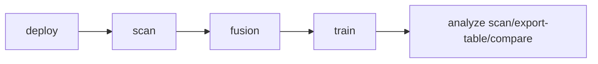

> Russian version: [../ru/getting-started/quickstart.md](../ru/getting-started/quickstart.md)

# Quick start

Below is a minimal working scenario from initialization to the first analysis of runs.

## Basic scenario

```bash
smartrain deploy
smartrain scan
smartrain fusion --dataset ds_a --dataset ds_b --classes "class_a,class_b"
smartrain train --data 2026-01-01_12-00-00-merged -y
smartrain analyze scan
```

## Pipeline diagram



## What is important to remember

- `scan` synchronizes sources and updates `datasets/datasets_info.json`.
- `fusion` creates the final dataset, usually in `datasets/<name>`.
- To exclude classes in `fusion`, use `--exclude-classes`, for example: `smartrain fusion --dataset ds_a --dataset ds_b --exclude-classes "background,trash" --output-name ds_filtered`.
- `train` uses `--data` as the name of the set of `datasets_info.json` or the path to the directory with `data.yaml`.
- `analyze` additionally supports `pr-curves`, `inference-benchmark`, `inference-plot`, `test-metrics-plot`.
- If the command runs from the workspace root, no extra global flags are required.

## Next step

After the basic scenario, go to:

- `docs/cli/overview.md` — complete tree of CLI commands;
- `docs/development/architecture.md` - diagrams and flow diagrams.
