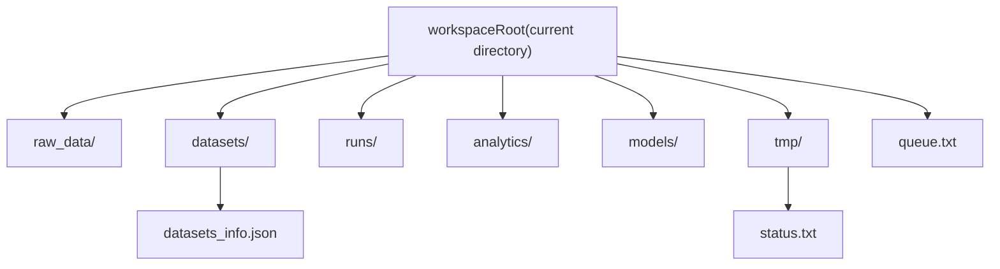

> Russian version: [../ru/getting-started/workspace.md](../ru/getting-started/workspace.md)

# Workspace

`smartrain` uses a single workspace root. The default mode is to work from the current directory.

Run `smartrain` or `smartrain --help` for a grouped command reference. Run `smartrain quickstart` for the step-by-step workflow guide.

You can optionally override the workspace root with a global flag:

- `smartrain --workspace /path/to/ws ...`.

## Directory structure

- `raw_data/` — external sources of datasets;
- `datasets/` — processed datasets and indexes (`datasets_info.json`, `class_names.json`);
- `runs/` — training outputs;
- `analytics/` — analytics artifacts (`analyze export-table`, etc.);
- `models/` — promoted models (`registry models-add`);
- `tmp/` — system files, including `tmp/status.txt`.

The default queue file is `queue.txt` in the workspace root.

## Workspace layout diagram



## Initialization

```bash
smartrain deploy
smartrain scan
smartrain train --data my_dataset -y
```
