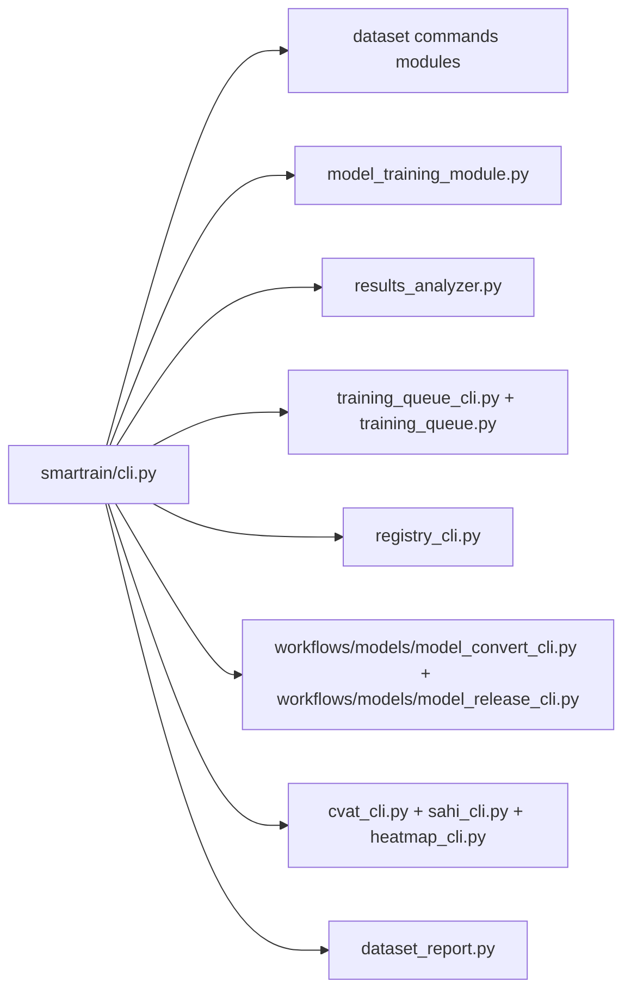

> Russian version: [../ru/reference/api.md](../ru/reference/api.md)

# Reference: APIs and modules

## Entry point

- `smartrain/cli.py` — Typer-router command.
- `smartrain/cli_argparse.py` is a basic argparse parser with default values ​​in `--help`.

## Basic modules

- `smartrain/datasets_json_former.py` — `scan`.
- `smartrain/dataset_former.py` — `fusion`.
- `smartrain/model_training_module.py` — `train`.
- `smartrain/training_queue.py` and `smartrain/training_queue_cli.py` are the queue.
- `smartrain/results_analyzer.py` — `analyze`.
- `smartrain/registry_cli.py` — `registry`.
- `smartrain/dataset_hash.py` — `hash`.
- `smartrain/inference_cli.py` — `inference`.
- `smartrain/dataset_report.py` — `report dataset`.
- `smartrain/workflows/models/model_convert_cli.py` and `smartrain/workflows/models/model_release_cli.py` — `model`.
- `smartrain/data_yaml_normalize.py` — `normalize-data-yaml`.
- `smartrain/migrate_models_to_smartrain.py` — `migrate-models`.
- `smartrain/clearml_upload.py` — `clearml-upload`.

## CLI mapping -> module

| CLI command | Module |
|---|---|
| `smartrain scan` | `smartrain/datasets_json_former.py` |
| `smartrain normalize-data-yaml` | `smartrain/data_yaml_normalize.py` |
| `smartrain fusion` | `smartrain/dataset_former.py` |
| `smartrain augment` | `smartrain/dataset_augment.py` |
| `smartrain balance` | `smartrain/dataset_balance.py` |
| `smartrain prune` | `smartrain/dataset_prune.py` |
| `smartrain roi` | `smartrain/dataset_roi_yolo.py` |
| `smartrain orient` | `smartrain/dataset_orient.py` |
| `smartrain stats` | `smartrain/dataset_stats.py` |
| `smartrain hash` | `smartrain/dataset_hash.py` |
| `smartrain train` | `smartrain/model_training_module.py` |
| `smartrain inference` | `smartrain/inference_cli.py` |
| `smartrain report dataset` | `smartrain/dataset_report.py` |
| `smartrain analyze` | `smartrain/results_analyzer.py` |
| `smartrain plot` | `smartrain/plot_creator.py` |
| `smartrain queue` / `queue-run` | `smartrain/training_queue_cli.py` / `smartrain/training_queue.py` |
| `smartrain registry` | `smartrain/registry_cli.py` |
| `smartrain model convert` / `model release` | `smartrain/workflows/models/model_convert_cli.py` / `smartrain/workflows/models/model_release_cli.py` |
| `smartrain migrate-models` | `smartrain/migrate_models_to_smartrain.py` |
| `smartrain clearml-upload` | `smartrain/clearml_upload.py` |
| `smartrain cvat` | `smartrain/cvat_cli.py` |
| `smartrain sahi` | `smartrain/sahi_cli.py` |
| `smartrain heatmap` | `smartrain/heatmap_cli.py` |

## Actual behavior notes

- `hash --validate`: `0` (match), `1` (mismatch), `2` (error).
- Extended subcommands are available in `analyze`: `pr-curves`, `inference-benchmark`, `inference-plot`, `test-metrics-plot`.
- The queue in the workspace uses `queue.txt` by default.

## Module map diagram

For detailed command examples, see [CLI section](../cli/overview.md).
