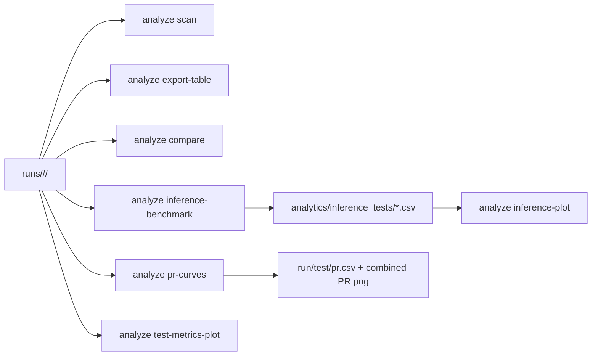

> English version: [../../cli/analyze.md](../../cli/analyze.md)

# CLI: анализ запусков

`smartrain analyze` работает по каталогам артефактов запусков.

Базовый корень поиска запусков: каталог `runs` внутри рабочего каталога (или путь из `--models-root`).

## Подкоманды

- `scan`
- `export-table`
- `compare`
- `interactive`
- `pr-curves`
- `inference-benchmark`
- `inference-plot`
- `test-metrics-plot`

## Примеры

```bash
smartrain analyze scan
smartrain analyze export-table -o runs_summary.csv
smartrain analyze compare --baseline /path/to/run_a --others /path/to/run_b /path/to/run_c --out-csv cmp.csv
smartrain analyze pr-curves --runs-group-dir runs/ds_a --data-yaml datasets/ds_a/data.yaml
smartrain analyze inference-benchmark --runs-group-dir runs/ds_a --data-yaml datasets/ds_a/data.yaml --split test --frames 200
smartrain analyze inference-plot --csv benchmark.csv --out benchmark.png
smartrain analyze test-metrics-plot --runs-group-dir runs/ds_a --metrics mAP50 mAP50-95 Box-F1
```

## Артефакты

- `export-table` формирует сводный CSV по найденным прогонам.
- `compare` может создавать таблицу сравнения и PNG-графики.
- `pr-curves` строит `test/pr.csv` для каждого run и общий PR-график.
- `inference-benchmark` формирует CSV с измерениями инференса.
- `inference-plot` строит визуализацию на основе CSV из `inference-benchmark`.
- `test-metrics-plot` строит bar-чарты по `test_metrics*.csv` для группы запусков.

`smartrain plot` остаётся устаревшей обёрткой и делегирует в `analyze`.

## Поток данных


