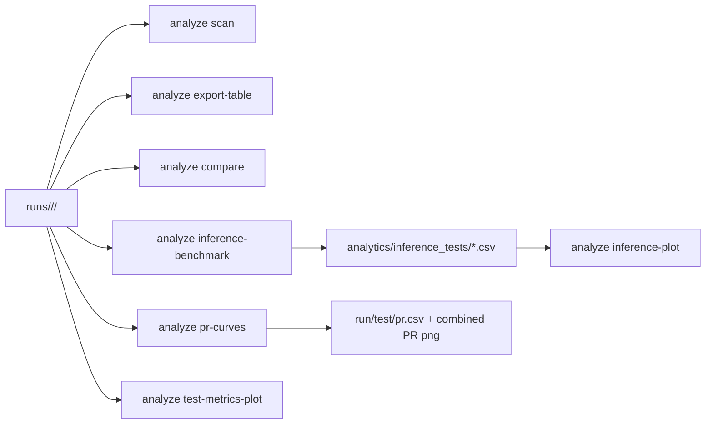

> English version: [../../cli/analyze.md](../../cli/analyze.md)

# CLI: анализ запусков

`smartrain analyze` работает по каталогам артефактов запусков.

Базовый корень поиска запусков: каталог `runs` внутри рабочего каталога (или путь из `--models-root`).

## Подкоманды

- `scan`
- `export-table`
- `compare`
- `interactive`
- `pr-curves`
- `inference-benchmark`
- `inference-plot`
- `test-metrics-plot`

## Примеры

```bash
smartrain analyze scan
smartrain analyze export-table -o runs_summary.csv
smartrain analyze compare --baseline /path/to/run_a --others /path/to/run_b /path/to/run_c --out-csv cmp.csv
smartrain analyze pr-curves --runs-group-dir runs/ds_a --data-yaml datasets/ds_a/data.yaml
smartrain analyze inference-benchmark --runs-group-dir runs/ds_a --data-yaml datasets/ds_a/data.yaml --split test --frames 200
smartrain analyze inference-plot --csv benchmark.csv --out-png benchmark.png
smartrain analyze test-metrics-plot --runs-group-dir runs/ds_a --metrics mAP50 mAP50-95 Box-F1
```

### Отчёт только по baseline (`analyze all`)

`analyze all` может собрать полный отчёт по **одному baseline-run** без `--others`:

```bash
# Non-interactive: нужны --baseline и --profile; --others необязателен
smartrain analyze all \
  --baseline runs/ds_a/my_run \
  --profile full \
  --data-yaml datasets/ds_a/data.yaml

# Interactive (TTY): при одном run в workspace он автоматически становится baseline;
# поле «Other run numbers» оставьте пустым для режима baseline-only
smartrain analyze all
```

В режиме baseline-only (`single_run_mode` в `session.json`):

- **Включено:** пересчёт метрик, сравнение форматов (pt/onnx/engine внутри run), PR-кривые, inference benchmark, Ultralytics test artifacts, отчёт markdown/PDF/ODT.
- **Пропускается (нужно 2+ run):** cross-run `compare` (delta/кривые), scatter speed-vs-quality, bar-чарты test-metrics по нескольким run.

`analyze compare` по-прежнему требует хотя бы один кандидат в `--others`.

## Артефакты

- `all` собирает полный отчет в `analytics/analyze-reports/<session>/` с `session.json`, `ru/en index.md`, `report-ru/en.odt|pdf`.
- Обновленная структура отчета:
  - легенда алиасов форматов и параметры расчета метрик перенесены в раздел 1
  - анализ скорости встроен в `4.2` как вложенный подраздел
  - таблица leaderboard перенесена в раздел заключения
- Обновлен рендер таблиц:
  - целочисленные значения показываются без `.0000`
  - заголовки колонок нормализуются в читаемые и единообразные названия
  - для ODT автоматически выставляются рамки таблиц, полужирные центрированные заголовки и более удобные ширины колонок
- `export-table` формирует сводный CSV по найденным прогонам.
- **Метрики segmentation в analyze:** для `task_type=segmentation` в таблицах сравнения используются mask-колонки (`mask_mAP50-95`, `Mask-F1`, …); при их отсутствии — fallback на box-метрики. `test-metrics-plot` подбирает дефолтные метрики по task и заголовкам CSV.
- `compare` может создавать таблицу сравнения и PNG-графики.
- `pr-curves` строит `test/pr.csv` для каждого run и общий PR-график.
- `inference-benchmark` формирует CSV с измерениями инференса.
- `inference-plot` строит визуализацию на основе CSV из `inference-benchmark`.
- `test-metrics-plot` строит bar-чарты по `test_metrics*.csv` для группы запусков.

`smartrain plot` остаётся устаревшей обёрткой и делегирует в `analyze`.

## Поток данных


