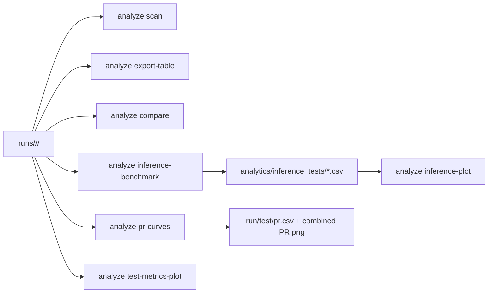

> English version: [../../cli/analyze.md](../../cli/analyze.md)

# CLI: анализ запусков

`smartrain analyze` работает по каталогам артефактов запусков.
Без подкоманды в TTY запускается интерактивный orchestrator полного анализа (эквивалент `smartrain analyze all`).

Базовый корень поиска: каталог `runs` внутри рабочего каталога (или путь из `--models-root`).

## Подкоманды

- `scan`
- `all`
- `export-table`
- `compare`
- `leaderboard`
- `pr-curves`
- `inference-benchmark`
- `inference-plot`
- `test-metrics-plot`

## Примеры

```bash
smartrain analyze scan
smartrain analyze              # интерактивный orchestrator (TTY)
smartrain analyze all --analytics-session my_session
smartrain analyze all --report-languages ru,en --scatter-x avg_inference_ms_per_frame --scatter-y mAP50-95
smartrain analyze all --val-batch 1 --val-imgsz 640 --val-half --gpu-only-val
smartrain analyze export-table -o runs_summary.csv
smartrain analyze compare --baseline /path/to/run_a --others /path/to/run_b /path/to/run_c --out-csv cmp.csv
smartrain analyze compare            # интерактивный fallback в TTY
smartrain analyze compare --baseline /path/to/run_a --others /path/to/run_b --out-insights cmp_insights.txt
smartrain analyze leaderboard --quality-metric mAP50-95 --speed-metric avg_inference_fps -o leaderboard.csv
smartrain analyze pr-curves --runs-group-dir runs/ds_a --data-yaml datasets/ds_a/data.yaml
smartrain analyze pr-curves --runs-group-dir runs/ds_a --data-yaml datasets/ds_a/data.yaml --pr-per-class
smartrain analyze inference-benchmark --runs-group-dir runs/ds_a --data-yaml datasets/ds_a/data.yaml --split test --frames 200
# Standalone benchmark по умолчанию --split test (строгий fail при отсутствии split).
# analyze all (profile=full) выбирает split автоматически: test → val → train.
smartrain analyze inference-plot --csv benchmark.csv --out-png benchmark.png
smartrain analyze test-metrics-plot --runs-group-dir runs/ds_a --metrics mAP50 mAP50-95 Box-F1
```

### Отчёт только по baseline (`analyze all`)

`analyze all` может собрать полный отчёт по **одному baseline-run** без `--others`:

```bash
# Non-interactive: нужны --baseline и --profile; --others необязателен
smartrain analyze all \
  --baseline runs/ds_a/my_run \
  --profile full \
  --data-yaml datasets/ds_a/data.yaml

# Interactive (TTY): при одном run в workspace он автоматически становится baseline;
# поле «Other run numbers» оставьте пустым для режима baseline-only
smartrain analyze all
```

В режиме baseline-only (`single_run_mode` в `session.json`):

- **Включено:** пересчёт метрик, сравнение форматов (pt/onnx/engine внутри run), PR-кривые, inference benchmark, Ultralytics test artifacts, отчёт markdown/PDF/ODT.
- **Пропускается (нужно 2+ run):** cross-run `compare` (delta/кривые), scatter speed-vs-quality, bar-чарты test-metrics по нескольким run.

`analyze compare` по-прежнему требует хотя бы один кандидат в `--others`.

## Артефакты

- Корень новых analyze-сессий по умолчанию: `workspace/analytics/analyze-reports/<session>/`.
- `all` собирает полную сессию:
  - `session.json`
  - `ru/index.md` и `en/index.md`
  - опционально `report-ru.pdf|odt` и `report-en.pdf|odt`
  - `artifacts/compare|metrics|inference|pr|leaderboard|table|speed_quality`
  - `artifacts/table/system_profile_compare.csv` (сравнение hardware profile по run)
- Обновлённая структура отчёта:
  - легенда алиасов форматов и параметры расчёта метрик — в **разделе 2** (Comparison Context / артефакты)
  - легенда датасетов: маркеры `- D1 = <имя>` (не одна строка `Datasets:`)
  - комментарии release — в сводных таблицах при наличии в `releases_manifest.json` / sidecar
  - в performance-таблицах «н/п», если нет `perf_*.json` (`model test --collect-performance`); не путать с «нет данных»
  - анализ скорости встроен в `4.2` как вложенный подраздел
  - leaderboard выводится в разделе заключения
- Обновлён рендер таблиц:
  - целочисленные значения без `.0000`
  - заголовки колонок нормализованы в читаемые названия (RU/EN)
  - для ODT: рамки таблиц, полужирные центрированные заголовки, настроенные ширины колонок
- Отчёты narrative-first (по смыслу сравнения): executive summary, контекст, quality, speed, per-class, заключение; подписи к таблицам/рисункам и опциональный глоссарий сокращений.
- `session.json` содержит секции: `metric_sources`, `pr_per_class`, `speed_quality`, `tables`, `images`, `cache`, `artifact_scope`, `artifact_failures` (и опционально `artifact_failures_summary`, когда speed/PR или другие этапы деградируют).
- Format comparison читает per-format артефакты из test manifests и поддерживает несколько артефактов на формат (`formats.<fmt>.artifacts`) с legacy fallback.
- Для run от external inference в cls/seg при отсутствии `probs/masks` у провайдера ожидаются degraded-contract payload:
  - classification: `task_outputs.classification = {}`
  - segmentation: `task_outputs.segments = []`
  - агрегаты: `summary.task_outputs_total`, `summary.capability_gap_images`
- **Метрики segmentation в analyze:** для `task_type=segmentation` в `format_metrics_compare_*.csv`, `compare_delta.csv`, `runs_summary.csv` (`test_mask_*`) используются mask-колонки (`mask_mAP50-95`, `Mask-F1`, …); при их отсутствии — fallback на box-метрики. `test-metrics-plot` подбирает дефолты по task и заголовкам CSV.
- `analyze all` поддерживает:
  - `--report-languages` (по умолчанию `ru,en`)
  - `--scatter-x` / `--scatter-y` для осей scatter speed-quality
  - memory-safe validation: `--val-batch`, `--val-imgsz`, `--val-half|--no-val-half`, `--gpu-only-val|--allow-cpu-fallback`
  - в интерактивном режиме validation profile (`batch/imgsz/half`) подставляется из `train/args.yaml` каждого run
- PR-артефакты:
  - `artifacts/pr/pr_all_classes.png`
  - `artifacts/pr/per_class/pr_class_*.png`
  - `artifacts/pr/per_class/pr_per_class.csv`
- Speed/quality артефакты:
  - `artifacts/speed_quality/speed_vs_map.png`
  - `artifacts/speed_quality/speed_quality.csv`
- Кэш single-run:
  - `runs/<...>/<run>/.smartrain_cache/analyze/cache_manifest.json`
  - `.../metrics/`, `.../pr/aggregate`, `.../pr/per_class`, `.../inference/bench_<fingerprint>.csv`
- `export-table` формирует сводный CSV по найденным run.
- `export-table` включает плоские `sys_*` колонки из `training_metadata.system_profile` (CPU/GPU/RAM/disk/platform).
- `compare` создаёт таблицу сравнения и PNG-графики.
- `compare` также пишет текстовые auto-insights (`--out-insights`).
- `compare` без `--baseline/--others` запускает интерактивный выбор в TTY.
- `pr-curves` строит per-run `test/pr.csv`, опциональный per-class CSV и общий PR-график.
- `inference-benchmark` формирует CSV с измерениями инференса (колонка `benchmark_split_used` — фактически использованный split).
- `inference-plot` строит визуализацию по CSV из `inference-benchmark`.
- `test-metrics-plot` строит bar-чарты по `test_metrics*.csv` для группы run.
- `leaderboard` формирует ранжированный CSV с `composite_score` по весам quality/speed/stability.

`smartrain plot` остаётся устаревшей обёрткой и делегирует в `analyze`.

## Разрешение data.yaml и политика split

Пути к датасету для speed/PR разрешаются через [`data_yaml_splits.py`](../../smartrain/services/analyze/data_yaml_splits.py):

- **Корень датасета:** если в `data.yaml` есть непустое поле `path:`, каталоги split (`train`, `val`, `test`) ищутся относительно него; иначе — относительно каталога yaml-файла. Важно для runtime yaml в `run/tmp/_runtime_data_*.yaml`, где `path:` указывает на `datasets/<name>/`.
- **Выбор data.yaml per-run:** при маппинге data.yaml на каждый run в `analyze all` предпочтителен workspace `datasets/*/data.yaml` перед runtime yaml из `train/args.yaml:data`.

### `analyze all` (orchestration, `profile=full`)

| Этап | Split / поведение при ошибке |
|------|------------------------------|
| Quality (compare, test-metrics) | Метрики обучения; отдельный `smartrain test` не обязателен |
| Speed (`inference-benchmark`) | Внутренне auto split **test → val → train**; при отсутствии изображений — `[WARN]`, `artifact_failures` с `reason_code=benchmark_missing_or_failed`, отчёт всё равно строится |
| PR (`pr-curves`) | Split test; при пустых curves — `[WARN]` и skip (без `sys.exit`) |
| `inference-plot` | Пропуск, если в `benchmark.csv` нет числовых метрик скорости |
| Finalize | Manifest + отчёт всегда, кроме режима `--strict-diagnostics` |

`benchmark.csv` содержит `benchmark_split_used`. Benchmark на `train` при отсутствии test/val — ориентировочная скорость, не профиль production test set.

### Standalone `inference-benchmark`

- `--split`: `train`, `val`, `test` (по умолчанию `test`).
- Разрешение через `path:` применяется, но **без fallback split**: при отсутствии запрошенного каталога — exit code 1.
- `--split auto` не в публичном CLI; используется внутри `analyze all`.

`--strict-diagnostics` на `analyze all` включайте только если отсутствие PR/metric_sources должно прерывать сессию (opt-in).

## Контракты

- Run считается обнаруживаемым, если в каталоге есть хотя бы один артефакт:
  - `training_metadata.json`, или
  - `train/args.yaml` / `train-ultralytics/args.yaml`, или
  - `train/results.csv` / `train-ultralytics/results.csv`, или
  - legacy `train/weights/last.pt`, или канон `models/<stem>.pt` (предпочтительно detect_*), или legacy `<run_dir_name>.pt` в корне run.
- Для сводки/метрик `analyze` по-прежнему требует читаемые metadata/metrics в зависимости от подкоманды.
- Канонические веса run — в `runs/<dataset>/<run>/models/` (detect_* stem; legacy в корне / `train/weights/` — через `resolve_run_model`).
- Каталоги release под `models/` тоже выбираемы (`--models-root` / интерактив); layouts R1–R3 поддерживаются (см. overview / run-layout).
- Для `analyze all --profile full`: при неполных Ultralytics PT-артефактах они достраиваются, затем пересчитываются отсутствующие confidence JSON (retry для stubs `confidence_compute_failed`).
- Опционально **`--compute-lrp`** (train / `analyze all`): пишет `tests/lrp_recommendations_{split}.json` (Optimal LRP / arXiv:1807.01696). Нужны prediction–GT matches; иначе `status=skipped`. **Не** меняет A/B/C `confidence_recommendations_*.json`. В отчёте секция **D: Optimal LRP** только если файл есть.
- **Prod confidence:** порог inference по умолчанию **0.25**. В JSON primary — objective **A** (F1), aggregation **macro**; `aggregations.micro` — при наличии support по классам (иначе fallback macro + reason). Inference opt-in: `--confidence-objective A|B|C` + `--confidence-recommendations <json>` (опционально `--confidence-aggregation macro|micro`).
- `export-table` читает:
  - `training_metadata.json`
  - последний `test_metrics*.csv` (первая строка)
  - `train/results.csv` (последняя эпоха)
- `compare` читает:
  - baseline/others последний `test_metrics*.csv` (первая строка) для `delta_*`
  - baseline/others `train/results.csv` для кривых эпох и bar last-epoch
- `leaderboard` читает последние метрики run и пишет `composite_score` по настраиваемым весам.
- `pr-curves`, `inference-benchmark`, `inference-plot`, `test-metrics-plot` поддерживают TTY-промпты при неполных аргументах.

## Поток данных


