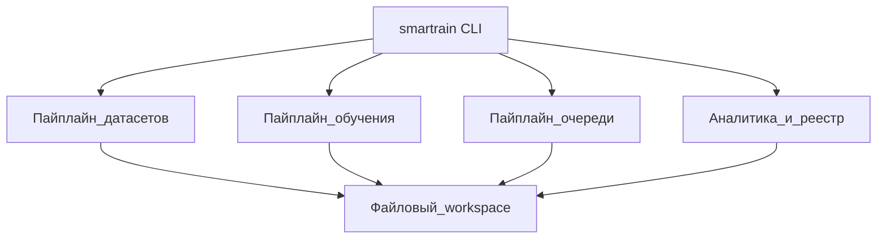
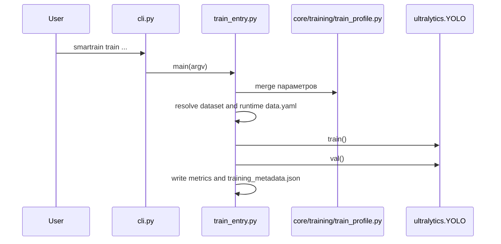
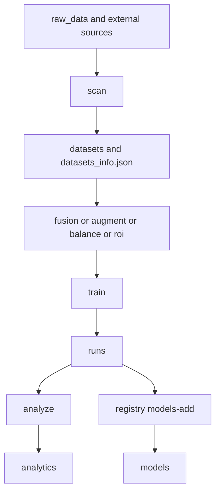
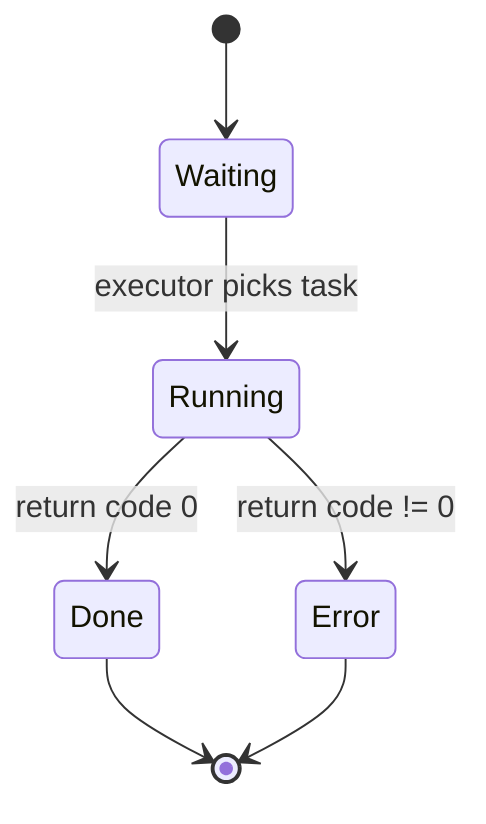
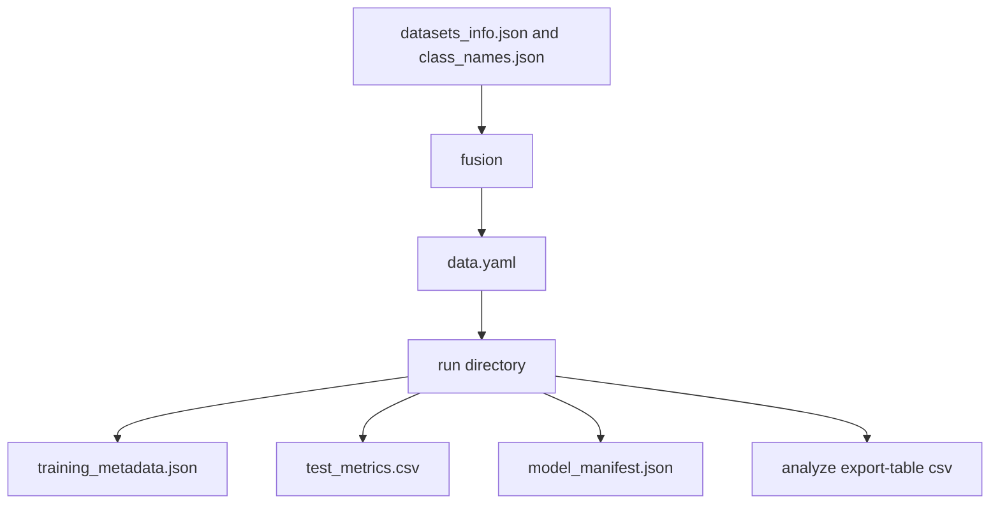
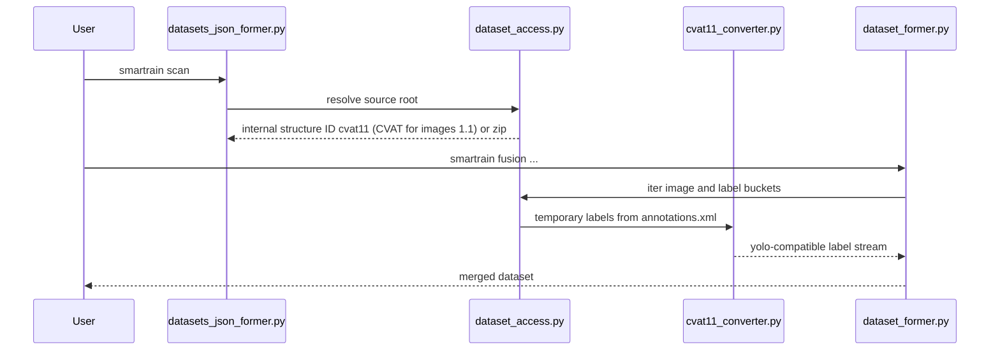

> English version: [../../development/architecture.md](../../development/architecture.md)

# Архитектура и диаграммы

Документ фиксирует фактические потоки в коде и помогает быстро локализовать изменения.

Источники правды для этого раздела: `smartrain/cli.py`, `smartrain/workflows/training/train_entry.py`, `smartrain/workflows/training/train_wiring.py`, `smartrain/workflows/analyze/results_analyzer.py`, `smartrain/workflows/queue/training_queue.py`, `smartrain/workflows/queue/training_queue_cli.py`, `smartrain/core/runtime/workspace_paths.py`, `smartrain/providers/cli.py`, `smartrain/providers/core/global_index.py`.

**Карта каталогов пакета:** [package-layout.md](../../development/package-layout.md) (EN).

## Навигация по функционалу

Маршрутизация команд — в `cli.py` (`_forward_argparse_command`, подкоманды `analyze`, приложения `cli_apps/*`). Таблица ниже помогает найти модуль для правки.

| Команда / область | Вход Typer (`cli.py`) | Argparse / `main` | Оркестрация / сервисы | Заметки |
|-------------------|----------------------|-------------------|------------------------|---------|
| `train` | `_forward_argparse_command` → `smartrain.cli_apps.train_app` | `workflows/training/train_entry.py` → `services/training/train_cli_main.py` | `services/train_service.py`, `services/training/*`, `workflows/training/train_wiring.py` (resume) | Профиль: `core/training/train_profile.py` |
| `test` | → `cli_apps/test_app` | `workflows/testing/model_test_cli.py` | `services/model_test_orchestrator.py`, `services/test_backend_dispatch.py` | Backends: `backends/train_test_registry.py` |
| `inference` | → `cli_apps/inference_app` | `workflows/inference/inference_cli.py` | `services/inference_service.py`, `workflows/inference/inference_backends.py` | |
| Подкоманды `analyze` | Typer → `_invoke_module_main("...analyze_entry", [...])` | `workflows/analyze/analyze_entry.py` → `results_analyzer.py` | `workflows/analyze/analyze_*_service.py`, `services/analyze_*.py` | Метрики / unified: `orchestrators/unified_gateway.py` |
| `scan` | `_forward_argparse_command` → `workflows/datasets/datasets_entry.py` | `datasets_json_former.py` | | Пишет `datasets_info.json` |
| `fusion` | → `workflows/datasets/dataset_former.py` | тот же модуль | | |
| `queue` | Typer → `workflows/queue/training_queue_cli.py` (`list`/`add`/…); `queue-run` → `_forward_argparse_command` → `training_queue.py` | `training_queue_cli` / `training_queue` | | Состояние очереди в workspace |

## CLI: интерактив и replay

Typer (`cli.py`, `_forward_argparse_command`) вырезает служебные токены `--nit` и `--smartrain-replay` (включая формы `--nit=…` / `--smartrain-replay=…`) до вызова `main(argv)` подкоманды; в argparse они не попадают. В скриптах предпочтителен отдельный токен `--nit`. `-y` / `--non-interactive` на пересылаемом argv по-прежнему отключают интерактив на стороне Typer (не вырезаются). Переменная `SMART_TRAIN_FORCE_NON_INTERACTIVE=1` (см. `smartrain/cli_support/typer_non_interactive.py`) задаёт тот же режим без флагов. Строки replay из `build_non_interactive_command` / `emit_replay` заканчиваются одним `--nit`. Подробнее (EN): [../../cli/replay-and-non-interactive.md](../../cli/replay-and-non-interactive.md).

| Режим | TTY | `--nit` | Неполные обязательные args | Поведение |
|-------|-----|---------|---------------------------|-----------|
| Ручной | да | нет | да/нет | Как сейчас: возможны промпты при неполноте; иначе ошибка парсера |
| Ручной | да | да | нет | Без интерактива Typer; модули как при non_interactive |
| Ручной | да | да | да | Ошибка (`parser.error` / явное сообщение), без интерактивного добора |
| Replay | да | да (в строке) | — | Предсказуемый неинтерактивный запуск |

У `train` остаются свои флаги подтверждения (`--yes` / `-y` для каталога и т.д.); это не то же самое, что Typer `--nit`. Вызов workflow через `python -m ...` без обёртки Typer не вырезает `--nit`; см. [../../refactor/tech-debt-cli-replay-nit.md](../../refactor/tech-debt-cli-replay-nit.md).

### Слои и импорты

- В `smartrain/services/` **запрещены** прямые импорты `smartrain.workflows.*`; доступ к реализациям — через фасады `smartrain/core/workflow_adapters/`. Регрессия: `tests/regression/test_train_service_guardrails.py`.
- Unified read/write: `orchestrators/unified_gateway.py`, `smartrain/unified/`.
- Развёрнутое описание слоёв и волн рефакторинга: [../../refactor/13-project-current-state.md](../../refactor/13-project-current-state.md).

## 1) Верхнеуровневая архитектура

Что показывает: четыре ключевых контура системы, связанные через файловый workspace.
Как читать: от `smartrain CLI` к подсистемам, затем к общему состоянию в FS.
Практический вывод: изменения контрактов файлов влияют сразу на несколько команд.

## 2) Последовательность `smartrain train`

Что показывает: полный путь от CLI-вызова до артефактов обучения.
Как читать: сверху вниз по временной оси, где каждый вызов уточняет контекст.
Практический вывод: при проблемах с параметрами нужно проверять этап merge-профиля до старта `YOLO.train()`.

## 3) Жизненный цикл данных в рабочем каталоге

Что показывает: как данные двигаются между основными каталогами.
Как читать: слева направо от источника к финальным артефактам.
Практический вывод: если ломается следующий этап конвейера, первым делом проверяется целостность `datasets_info.json` и выходы `fusion`.

## 4) Состояния задачи очереди

Что показывает: статусы строки из `queue.txt`.
Как читать: переходы определяются результатом запуска команды.
Практический вывод: обработка ретраев не автоматизирована, повторный запуск выполняется вручную.

Примечание по терминам: статусы на диаграмме (`Waiting`, `Running`, `Done`, `Error`) соответствуют фактическим строкам в `status.txt`.

## 5) Контракты артефактов

Что показывает: зависимости между файлами-контрактами.
Как читать: стрелка означает, что один артефакт является входом для следующего шага.
Практический вывод: любые изменения схемы `training_metadata.json` требуют проверки `analyze` и `registry`.

## 6) Путь `scan/fusion` для zip и CVAT 1.1

Что показывает: как CVAT/zip-источники приводятся к единому потоку для merge.
Как читать: временные метки генерируются на этапе доступа к данным, а не как отдельный обязательный импорт.
Практический вывод: `cvat import` нужен не всегда, так как `fusion` умеет нативно работать с CVAT for images 1.1 (internal ID `cvat11`).
