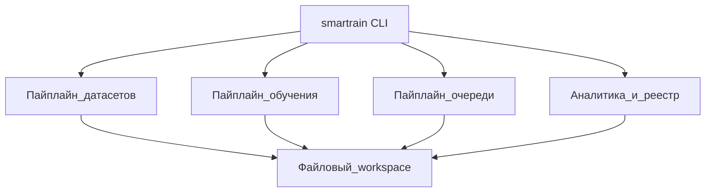
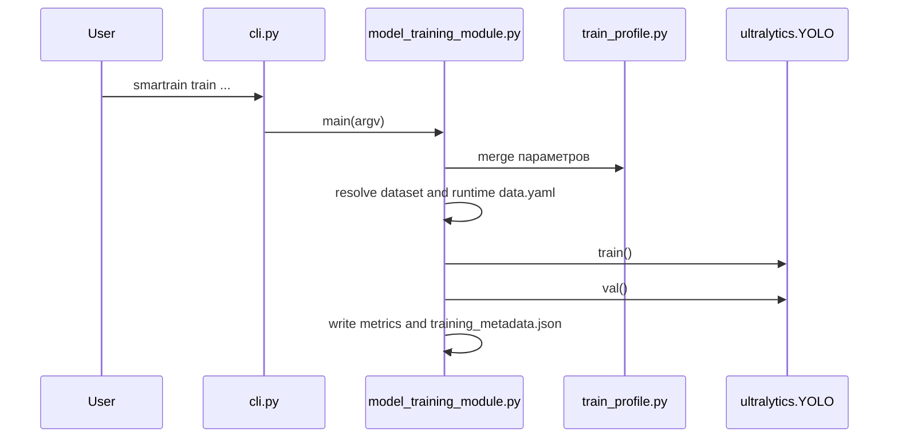
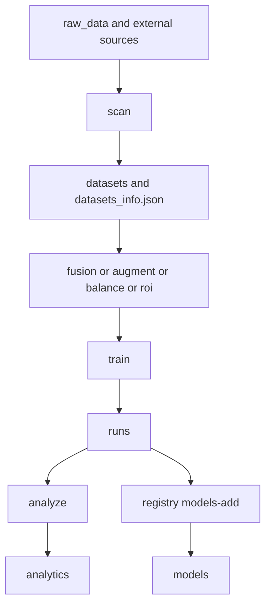
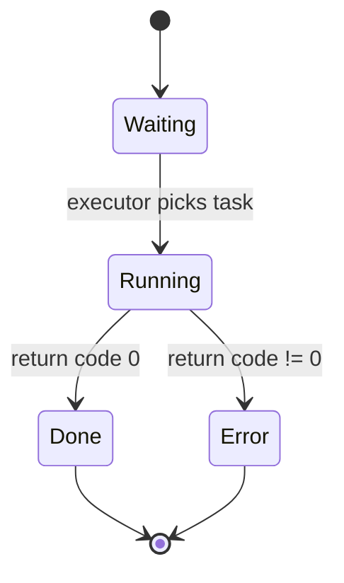
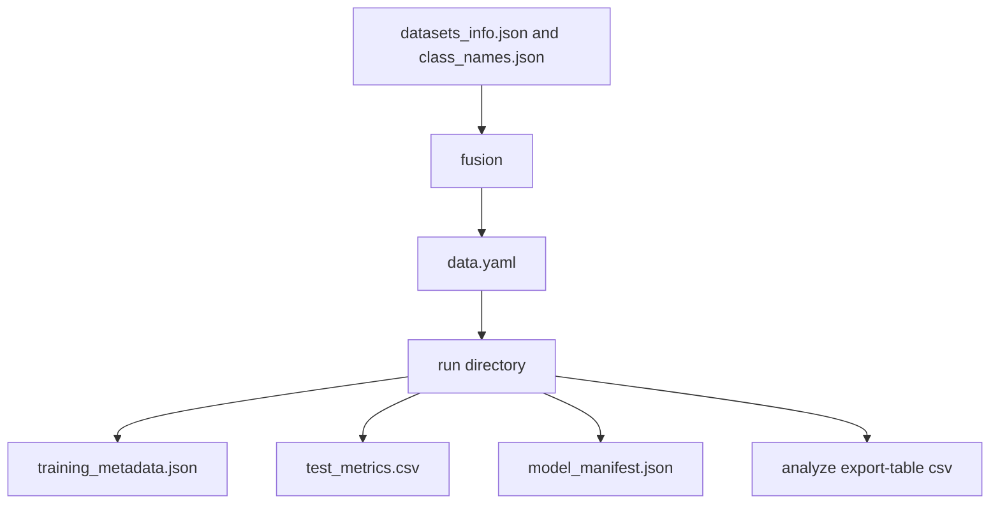
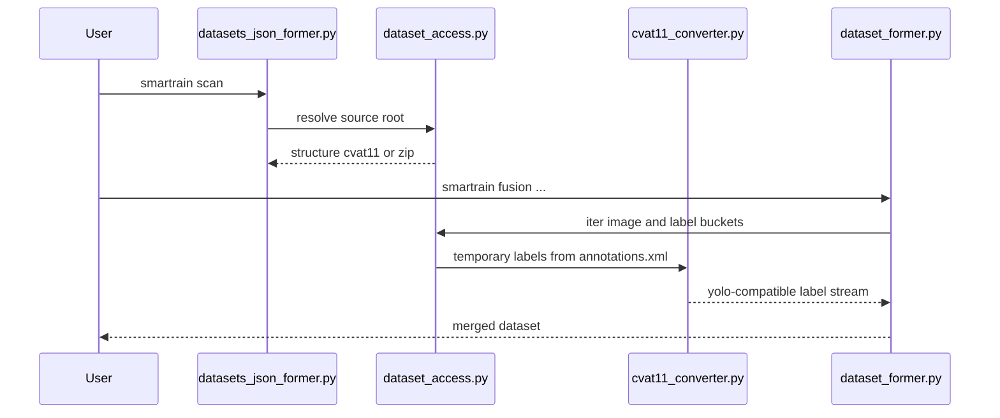

> English version: [../../development/architecture.md](../../development/architecture.md)

# Архитектура и диаграммы

Документ фиксирует фактические потоки в коде и помогает быстро локализовать изменения.

Источники правды для этого раздела: `smartrain/cli.py`, `smartrain/model_training_module.py`, `smartrain/results_analyzer.py`, `smartrain/training_queue.py`, `smartrain/workspace_paths.py`.

## 1) Верхнеуровневая архитектура

Что показывает: четыре ключевых контура системы, связанные через файловый workspace.
Как читать: от `smartrain CLI` к подсистемам, затем к общему состоянию в FS.
Практический вывод: изменения контрактов файлов влияют сразу на несколько команд.

## 2) Последовательность `smartrain train`

Что показывает: полный путь от CLI-вызова до артефактов обучения.
Как читать: сверху вниз по временной оси, где каждый вызов уточняет контекст.
Практический вывод: при проблемах с параметрами нужно проверять этап merge-профиля до старта `YOLO.train()`.

## 3) Жизненный цикл данных в рабочем каталоге

Что показывает: как данные двигаются между основными каталогами.
Как читать: слева направо от источника к финальным артефактам.
Практический вывод: если ломается следующий этап конвейера, первым делом проверяется целостность `datasets_info.json` и выходы `fusion`.

## 4) Состояния задачи очереди

Что показывает: статусы строки из `queue.txt`.
Как читать: переходы определяются результатом запуска команды.
Практический вывод: обработка ретраев не автоматизирована, повторный запуск выполняется вручную.

Примечание по терминам: статусы на диаграмме (`Waiting`, `Running`, `Done`, `Error`) соответствуют фактическим строкам в `status.txt`.

## 5) Контракты артефактов

Что показывает: зависимости между файлами-контрактами.
Как читать: стрелка означает, что один артефакт является входом для следующего шага.
Практический вывод: любые изменения схемы `training_metadata.json` требуют проверки `analyze` и `registry`.

## 6) Путь `scan/fusion` для zip и CVAT 1.1

Что показывает: как CVAT/zip-источники приводятся к единому потоку для merge.
Как читать: временные метки генерируются на этапе доступа к данным, а не как отдельный обязательный импорт.
Практический вывод: `cvat import` нужен не всегда, так как `fusion` умеет нативно работать с `cvat11`.
