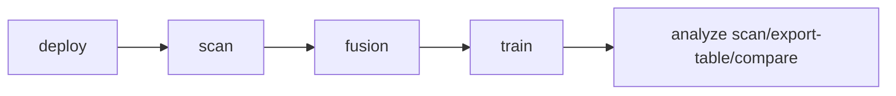

> English version: [../../getting-started/quickstart.md](../../getting-started/quickstart.md)

# Быстрый старт

Ниже приведён минимальный рабочий сценарий от инициализации до первого анализа запусков.

## Базовый сценарий

```bash
smartrain deploy
smartrain scan
smartrain fusion --dataset ds_a --dataset ds_b --classes "class_a,class_b"
smartrain train --data 2026-01-01_12-00-00-merged -y
smartrain analyze scan
```

## Схема конвейера



## Что важно помнить

- `scan` синхронизирует источники и обновляет `datasets/datasets_info.json`.
- `fusion` создаёт итоговый датасет, обычно в `datasets/<name>`.
- Для исключения классов в `fusion` можно использовать `--exclude-classes`, например: `smartrain fusion --dataset ds_a --dataset ds_b --exclude-classes "background,trash" --output-name ds_filtered`.
- `train` использует `--data` как имя набора из `datasets_info.json` или путь к каталогу с `data.yaml`.
- `analyze` дополнительно поддерживает `pr-curves`, `inference-benchmark`, `inference-plot`, `test-metrics-plot`.
- При запуске из корня workspace дополнительные глобальные флаги не требуются.

## Следующий шаг

После базового сценария переходите в:

- `docs/cli/overview.md` — полное дерево CLI-команд;
- `docs/development/architecture.md` — схемы и диаграммы потоков.
