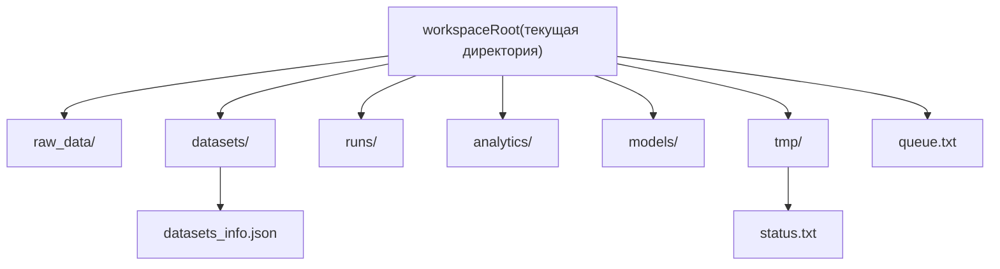

> English version: [../../getting-started/workspace.md](../../getting-started/workspace.md)

# Рабочий каталог (workspace)

`smartrain` использует единый корень рабочего каталога. Базовый режим — запуск из текущей директории.

Команды `smartrain` или `smartrain --help` показывают сгруппированный справочник. Пошаговое руководство: `smartrain quickstart`.

При необходимости корень можно переопределить глобальным флагом:

- `smartrain --workspace /path/to/ws ...`.

## Структура каталогов

- `raw_data/` — внешние источники датасетов;
- `datasets/` — рабочие датасеты и индекс (`datasets_info.json`, `class_names.json`);
- `runs/` — результаты обучения;
- `analytics/` — артефакты аналитики (`analyze export-table` и др.);
- `models/` — релизы (`model release` в `models/<dataset>/<run_id>/…`, плюс `releases_manifest.json`) и registry-бандлы (`registry models-add`);
- `tmp/` — служебные файлы, включая `tmp/status.txt`.

Файл очереди по умолчанию: `queue.txt` в корне рабочего каталога.

Для общей SMB-папки на нескольких машинах см. [Общий workspace](shared-workspace.md).

## Схема структуры workspace



## Инициализация

```bash
smartrain deploy
smartrain scan
smartrain train --data my_dataset -y
```
