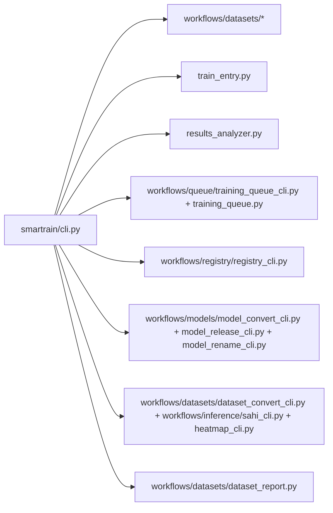

> English version: [../../reference/api.md](../../reference/api.md)

# Справочник: API и модули

## Точка входа

- `smartrain/cli.py` — Typer-роутер команд.
- `smartrain/cli_entrypoints/support/cli_argparse.py` — общие argparse-хелперы (например `CliArgumentParser`).

## Основные модули

- `smartrain/workflows/datasets/datasets_json_former.py` — `scan`.
- `smartrain/workflows/datasets/dataset_former.py` — `fusion`.
- `smartrain/workflows/training/train_entry.py` — `train`.
- `smartrain/workflows/queue/training_queue_cli.py` и `smartrain/workflows/queue/training_queue.py` — очередь (`queue` и `queue-run`).
- `smartrain/workflows/analyze/results_analyzer.py` — `analyze`.
- `smartrain/workflows/registry/registry_cli.py` — `registry`.
- `smartrain/workflows/datasets/dataset_hash.py` — `hash`.
- `smartrain/workflows/inference/inference_cli.py` — `inference`.
- `smartrain/workflows/datasets/dataset_report.py` — `dataset report`.
- `smartrain/workflows/datasets/dataset_rename_cli.py` — `dataset rename`.
- `smartrain/workflows/datasets/dataset_convert_cli.py` — `dataset convert`.
- `smartrain/workflows/models/model_convert_cli.py`, `model_release_cli.py` и `model_rename_cli.py` — `model`.
- `smartrain/workflows/datasets/data_yaml_normalize.py` — `normalize-data-yaml`.
- `smartrain/workflows/migration/migrate_models_to_smartrain.py` — `migrate-models`.
- `smartrain/workflows/analyze/clearml_upload.py` — `clearml-upload`.

## Соответствие CLI -> модуль

| CLI команда | Модуль |
|---|---|
| `smartrain scan` | `smartrain/workflows/datasets/datasets_json_former.py` |
| `smartrain normalize-data-yaml` | `smartrain/workflows/datasets/data_yaml_normalize.py` |
| `smartrain fusion` | `smartrain/workflows/datasets/dataset_former.py` |
| `smartrain augment` | `smartrain/workflows/datasets/dataset_augment.py` |
| `smartrain balance` | `smartrain/workflows/datasets/dataset_balance.py` |
| `smartrain prune` | `smartrain/workflows/datasets/dataset_prune.py` |
| `smartrain roi` | `smartrain/workflows/datasets/dataset_roi_yolo.py` |
| `smartrain orient` | `smartrain/workflows/datasets/dataset_orient.py` |
| `smartrain rotate` | `smartrain/workflows/datasets/dataset_rotate.py` |
| `smartrain stats` | `smartrain/workflows/datasets/dataset_stats.py` |
| `smartrain hash` | `smartrain/workflows/datasets/dataset_hash.py` |
| `smartrain train` | `smartrain/workflows/training/train_entry.py` (`train_wiring.py`; CLI в `services/training/train_cli_main.py`) |
| `smartrain inference` | `smartrain/workflows/inference/inference_cli.py` |
| `smartrain dataset report` | `smartrain/workflows/datasets/dataset_report.py` |
| `smartrain dataset rename` | `smartrain/workflows/datasets/dataset_rename_cli.py` |
| `smartrain dataset convert` | `smartrain/workflows/datasets/dataset_convert_cli.py` |
| `smartrain analyze` | `smartrain/workflows/analyze/results_analyzer.py` |
| `smartrain plot` | `smartrain/workflows/analyze/plot_creator.py` |
| `smartrain queue` / `queue-run` | `smartrain/workflows/queue/training_queue_cli.py` / `smartrain/workflows/queue/training_queue.py` |
| `smartrain registry` | `smartrain/workflows/registry/registry_cli.py` |
| `smartrain model convert` / `model release` / `model rename` | `smartrain/workflows/models/model_convert_cli.py` / `model_release_cli.py` / `model_rename_cli.py` |
| `smartrain migrate-models` | `smartrain/workflows/migration/migrate_models_to_smartrain.py` |
| `smartrain clearml-upload` | `smartrain/workflows/analyze/clearml_upload.py` |
| `smartrain sahi` | `smartrain/workflows/inference/sahi_cli.py` |
| `smartrain heatmap` | `smartrain/workflows/inference/heatmap_cli.py` |

## Актуальные примечания по поведению

- `hash --validate`: `0` (совпадение), `1` (расхождение), `2` (ошибка).
- Расширенные подкоманды `analyze`: `pr-curves`, `inference-benchmark`, `inference-plot`, `test-metrics-plot`.
- Очередь в workspace по умолчанию использует `queue.txt`.

## Диаграмма соответствия модулей

Подробные примеры команд — в [разделе CLI](../../cli/overview.md).
