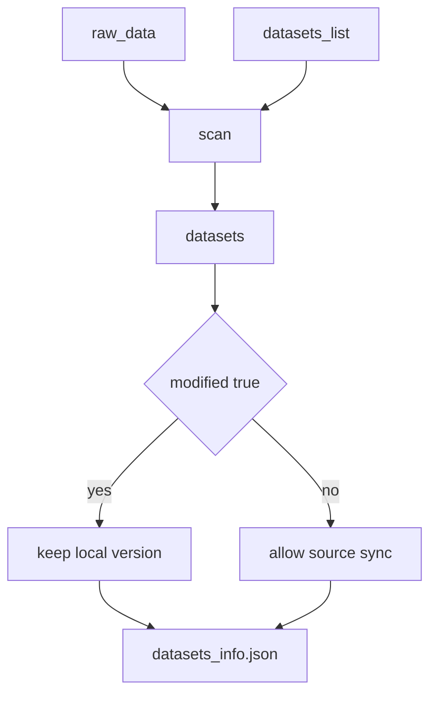

# Единый workspace

Корень задаётся **`--workspace`** (глобальная опция Typer у `smartrain`) или переменной **`SMART_TRAIN_WORKSPACE`**. В коде модулей при вызове `resolve_workspace_root()` **непустой** аргумент CLI перекрывает env; если оба пусты — **ValueError** (кроме сценариев без workspace, например legacy-пути у `fusion`).

При запуске CLI, если переменная окружения не задана, Typer может выставить **`SMART_TRAIN_WORKSPACE`** в текущий каталог — см. [`smartrain/cli.py`](../smartrain/cli.py).

## Каталоги

| Путь | Назначение |
|------|------------|
| `raw_data/` | Исходные датасеты для команды `scan` |
| `datasets/datasets_info.json` | Описание датасетов, пригодных для обучения |
| `datasets/class_names.json` | Нормализация имён классов |
| `datasets/` | Рабочий каталог датасетов; `scan` пишет подготовленные копии, `fusion` создаёт merged-наборы в `datasets/<имя>/` |
| `runs/` | Прогоны обучения (`train` / `model_training_module`) |
| `analytics/` | Сессии анализа (`analyze export-table` и др. с `--analytics-session`) |
| `models/` | Промотированные веса (`registry models-add`, …) |
| `tmp/` | В т.ч. `tmp/status.txt` для исполнителя очереди |
| `queue.txt` (в корне workspace) | Файл очереди обучения по умолчанию |

Создание каталогов и пустых JSON: **`smartrain deploy`** → [`deploy_workspace()`](../smartrain/workspace_paths.py).

## Поле `data_path` в `datasets_info.json`

Строка: **абсолютный** путь или путь **относительно корня workspace**. Если ключа нет, корень данных = `datasets/<ключ_записи>`.

## Поля синхронизации scan

В записях `datasets_info.json` используются служебные поля:
- `dataset_hash` — хеш текущего каталога в `datasets/<name>`
- `source_hash` — хеш источника, из которого был выполнен перенос
- `source_ref` — ссылка на источник (`raw_data/...`, путь из list-файла, путь из `--dataset`)
- `source_signature` — быстрый маркер изменений источника
- `modified` — признак ручной модификации датасета в `datasets`; при `true` синхронизация из `raw_data` блокируется

## Сценарий обновления

## Код

- [`smartrain/workspace_paths.py`](../smartrain/workspace_paths.py) — `WorkspaceLayout`, `resolve_workspace_root`, `resolve_dataset_root`, `deploy_workspace`, пути к `queue.txt` и `tmp/status.txt`
- [`smartrain/registry_cli.py`](../smartrain/registry_cli.py) — подкоманды `runs-list`, `runs-info`, `runs-metrics`, `models-add`, `models-list`, `models-info`, `models-remove`
